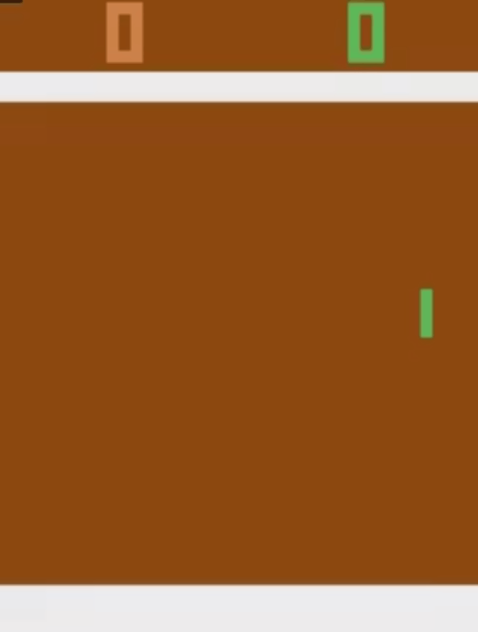

# Intelligent-Pong-Player
An Intelligent Pong Player using Reinforcement Learning

<h1 align="center">
    
</h1>

GIF [Source](https://gym.openai.com/envs/Pong-v0/) and created using ScreenToGIF


# Table of Contents
- [Introduction](#introduction)
- [Methods](#methods)
- [Dataset](#dataset)
- [Methodology](#methodology)
- [Installation](#installation)
- [Requirements](#requirements)
- [Results](#results)
- [References](#references)
- [Contribution](#contribution)

## Introduction
Pong is a classic arcade game. It is a 2D sports game that
simulates table tennis. The player has to move the
paddle up or down to hit the ball.
Player scores a point when opponent misses the ball.
Goal is to score more points than the opponent.

## Methods
In this project we will use Q learning & Deep Reinforcement
learning to create an intelligent player by using
screen images as input.
Agent’s performance is measured by the points
scored by it.

## Dataset
The environment was taken from [here](https://gym.openai.com/envs/Pong-v0/) on which Q learning and Reinforcement learning was applied.

## Methodology
Here once the environment is set up the current state of the game is continuously returned in the form
of pixel values. The raw Atari frames returned are pixel images with a size of 210 x 160. Directly
using them would be too heavy computationally. So, first of all the pre-processing steps are applied

* Preprocessing Steps: The frames are first converted form RGB representation to gray-scale
values. Further, it is down sampled to a 110 x 84 image and also some of the top and below
portion of the game screen is not useful and does not give any useful information about the
current state of the game. Therefor it is also cropped and the image is reduced to a size of 84 x 84.

* Exploration-exploitation policy: This is a common policy which is used while applying
reinforcement learning. We want the agent to do more of exploration in the beginning and
less of exploitation because it has almost no knowledge of the environment. The reverse of
this approach needs to be followed as the game progresses. This is done by appropriately
choosing epsilon decay values and minimum epsilon values.

* Storing the state of the game: It is not possible to know the direction of the movement of the
ball in the game by just looking at one frame. So, here the state of the game is represented by
stacking 4 continuous frames together and then storing them.

* Creating Replay Memory: Here a replay memory is needed so that while the network being
trained then the samples on which it is being trained are not just consecutive samples and can
be randomly drawn from the memory. Transitions are stored in the replay memory where
each transition consists of [state, action, reward, terminal, new_state] which is a list. A state
as discussed previously is formed by stacking 4 consecutive frames and the new_state is formed by replacing the oldest frame in the state by the new frame. The variable reward
denotes the reward that the agent gets on going from state to new_state and terminal denotes
whether the episode terminates on reaching new_state.

* Q learning: The main network predicts the Q value by taking a batch of 32 transitions from
the replay buffer that is being created continuously. The Q value predicted by the network is
called the Qpredicted. Now the loss function is calculated using the Qpredicted value and the
Qtarget value obtained using the Bellman’s equation. One approach would be to calculate the
Qtarget value using the main network only and thus using the parameters which are
continuously changing. A better approach is to use a separate network called target network
for calculating Qtarget. We have used the approach of using a separate target network.

* Target network: The target network as discussed above is used to find Qtarget values. The
weights of this network are not being updated continuously. The main network weights are
copied to the target network only after specific number of steps.

* Loss function: We have used the Huber loss function for calculating the loss between
Qpredicted and Qtarget. The model is made to fit using these loss values i.e. the weights are
updated.

* Double Q Learning: As our agent was not playing well after implementing all the above
concepts, we then also applied Double Q learning methodology. The method has a slight
different approach for the Q-value of the next state that is used in the Bellman equation.

* Network structure: The network has 4 convolution layers with different filter sizes. The
activation function used is relu. There is one fully connected final layer.

## Installation
```bash
python Pong_Code.ipynb
```
Run Pong_Code.ipynb in Jupyter (if you have more than 8gb RAM) or [Google Colab](https://colab.research.google.com/)

## Requirements
Following are the libraries required
* numpy
* random
* gym
* keras
* tensorflow

## Results
We have tried varying the parameter values used in the model but still the agent is not able to play
well the reason being the hardware constraints. Here we are able to train the agent for more than
300 episodes as the RAM requirement shoots up drastically.

## References
[1] Volodymyr Mnih, Koray Kavukcuoglu, David Silver, Alex Graves, Ioannis Antonoglou, Daan
Wierstra, Martin Riedmiller – “Playing Atari with Deep Reinforcement Learning”

[2] Ziyu Wang, Tom Schaul, Matteo Hessel, M Hado van Hasselt, Marc Lanctot, Nando de
Freitas – “Dueling Network Architectures for Deep Reinforcement Learning”

[3] Mnih et al. 2015 – “Human-level control through deep reinforcement learning”

## Contribution
Project was created by [Rahul Maheshwari](mailto:rahul19027@iiitd.ac.in) and [Ankit Agarwal](mailto:ankit19021@iiitd.ac.in) Feel free to contact us.
